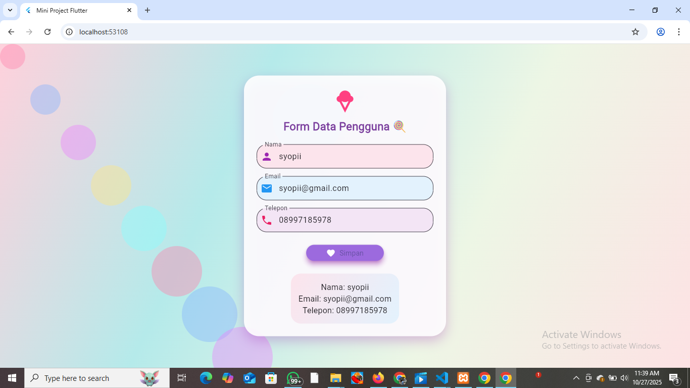

<<<<<<< HEAD
# 🍭 Mini Project Flutter – Form Data Pengguna 🎀

Hai! 🌸  
Ini adalah **Mini Project Flutter** dengan tampilan bertema **pastel candy** 🍬💖  
Project ini menampilkan **form input data pengguna** (Nama, Email, Telepon) dengan desain yang manis, lembut, dan ceria seperti permen 🍡

---

## 🌈 Preview Tampilan
Berikut tampilan aplikasi saat dijalankan di browser (Flutter Web) 💻👇  



> 🌸 Warna lembut biru–pink pastel dengan elemen melayang seperti permen 🍬  
> ✨ Cocok untuk project bertema fun, girly, atau event lucu seperti birthday UI!

---

## 💫 Fitur Aplikasi

✨ **Input Form Pengguna**
- Nama  
- Email  
- Telepon  

🎨 **Tampilan Menarik**
- Background gradasi pink–biru lembut 🌈  
- Bubble warna-warni seperti permen 🍭  
- Ikon lucu dan tombol unyu dengan bayangan lembut ☁️  

🧁 **Responsif**
- Dapat dijalankan di browser (Flutter Web)
- Bisa juga di Android setelah di-build dengan Flutter SDK  

---

## 🧰 Teknologi yang Digunakan
| Komponen | Deskripsi |
|-----------|------------|
| 🩵 **Flutter** | Framework UI untuk aplikasi cross-platform |
| 💙 **Dart** | Bahasa pemrograman utama Flutter |
| 💗 **Material Design** | Komponen dan gaya desain dari Flutter |

---

## 💻 Cara Menjalankan Project

1. Pastikan Flutter sudah terinstal (bisa cek dengan perintah berikut di CMD):
   ```bash
   flutter --version
=======
# mini_project_flutter
>>>>>>> 3b6585e29d90aa20a9765a8b3b2f5bdeaac6b60e
